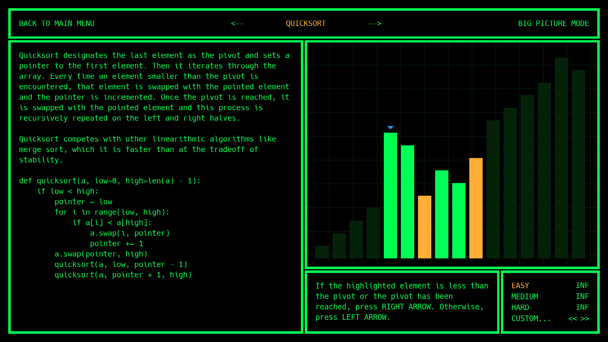

 

  

  <h1 align="center">Human Computer Simulator</h1>

  

    Become your favorite sorting algorithm!
  

Have you ever wondered what it feels like to be a sorting algorithm‽ Now you can find out! In *Human Computer Simulator*, you control an algorithm operating on an array, trying to sort as fast as possible. With 10 different levels, a cool visualization, and optional sound effects, you can fulfill your sorting dreams...

A demo (large download warning: ~5 MB gzipped) is available on this repository's [Github Pages](https://danielzting.github.io/human-computer-simulator). It requires a desktop browser with support for WebAssembly and WebGL.

## Anti-pitch

This is beta software, so there will inevitably be things that are confusing, broken, or straight up wrong. See the [issues](https://github.com/DanielZTing/human-computer-simulator/issues) for a list of caveats and don't hesitate to open another one if you find something new.

## Contributing

I welcome any bug reports or feature requests. Pull requests are appreciated as well, though I apologize for my code in advance. If you like this so much that you want to [throw money at me](https://venmo.com/DanielZTing), I will add any 80x24 ASCII text block of your choosing to the README and credits.